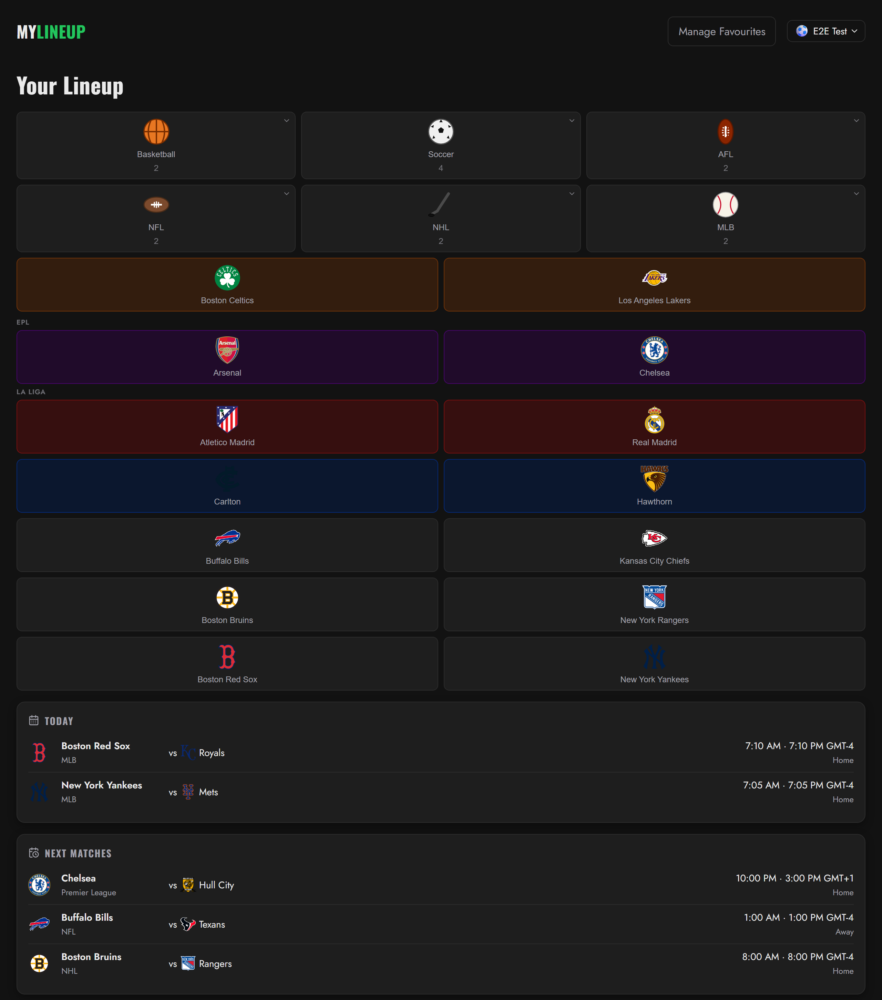
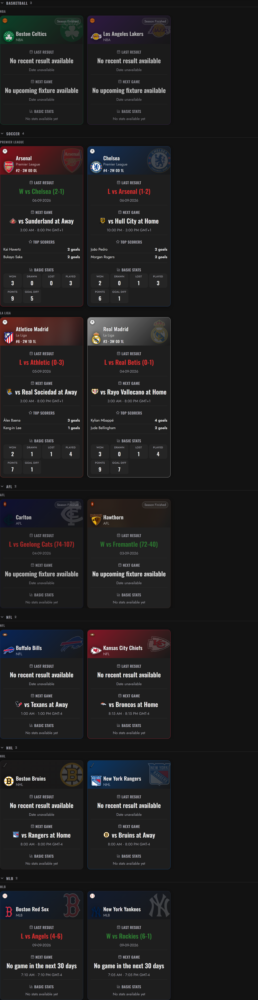
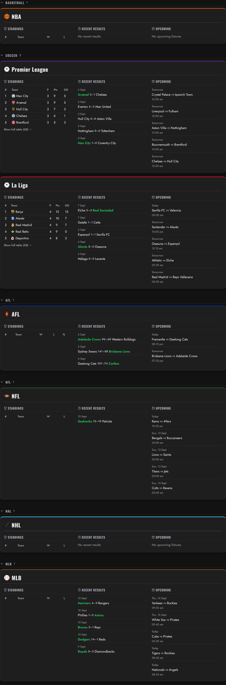
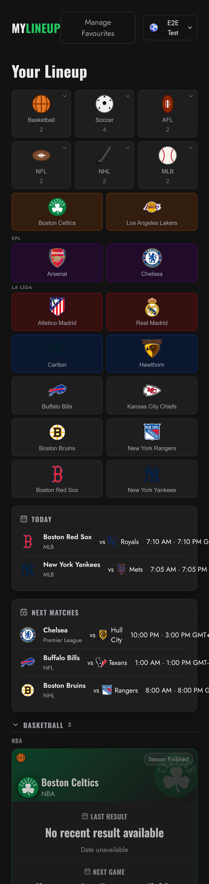

# 🏟 MyLineup

[](https://github.com/geezmulticoloredbob/MyLineUp/actions/workflows/ci.yml)
[](LICENSE)

A personalised sports dashboard that lets users follow their favourite teams across multiple leagues in one unified interface — fixtures, results, ladders and stats, aggregated into a single feed.

## 📌 Overview

MyLineup is a full-stack MERN application (React + Vite on the client, Express + MongoDB on the server). Users register, pick the leagues and teams they follow, and land on a personalised dashboard that pulls live data from each league's sports API.

Core capabilities:

- Account registration/login with JWT authentication
- Guided onboarding to select followed leagues and favourite teams
- A personal dashboard aggregating, per favourite team:
  - Latest result and next fixture
  - Ladder / league table position
  - Season stats and top scorers
  - Team logo and brand colours (sourced from ESPN)
- A today's games feed showing live results and fixtures across followed leagues
- Drag-and-drop reordering of leagues and teams on the dashboard
- Dark/light theme, with an optional background tint derived from a chosen team's colours
- Account settings (update profile, password, and avatar icon) via an account menu

Supported leagues:

- NBA
- Premier League (EPL)
- AFL
- FIFA World Cup
- La Liga
- Bundesliga
- Serie A
- Ligue 1
- Championship
- Eredivisie
- Champions League
- NFL
- NHL
- MLB

## 📸 Screenshots

**Dashboard overview** — sport tiles, followed teams, and the today's games feed



**Team cards, grouped by sport and league**



**League standings, results and upcoming fixtures**



**Mobile view**



## 🚀 Tech Stack

**Frontend**
- React 19 + Vite
- React Router
- Vitest + Testing Library
- ESLint

**Backend**
- Node.js + Express 5
- MongoDB (Mongoose ODM)
- JWT authentication (bcrypt-hashed passwords, rate-limited auth endpoints, Helmet + CORS)
- Jest + Supertest, with `mongodb-memory-server` for integration tests
- ESLint

**External data**
- BallDontLie API (NBA)
- football-data.org (EPL, La Liga, Bundesliga, Serie A, Ligue 1, Championship, Eredivisie, Champions League, World Cup)
- Squiggle (AFL)
- ESPN's public site API (NFL, NHL, MLB) and CDN (team logos and brand colours across all leagues)

## 🧠 Core Features

### 1️⃣ Accounts & Onboarding
- Register / login with JWT-backed sessions
- Guided onboarding flow to pick followed leagues and favourite teams before reaching the dashboard
- Account menu for updating profile details, password, and avatar icon

### 2️⃣ Personal Dashboard
- Per-team cards showing latest result, next fixture, ladder position, and stats, hydrated live from each league's API (with graceful fallback if a source is unavailable)
- Today's games feed across all followed leagues
- Drag-and-drop reordering of leagues and teams, persisted per user

### 3️⃣ Favourites
- Add/remove favourite teams per league from the onboarding flow or dashboard
- Favourites drive both the dashboard cards and the games feed

### 4️⃣ Theming
- Dark theme by default, with a light theme toggle
- Optional dashboard background tint derived from a favourite team's brand colours

## 🗄 Data Models

**User**
- `username`, `email`, `password` (bcrypt-hashed)
- `followedLeagues[]` — one or more of `NBA`, `EPL`, `AFL`, `WC`, `LALIGA`, `BUNDESLIGA`, `SERIEA`, `LIGUE1`, `CHAMPIONSHIP`, `EREDIVISIE`, `UCL`, `NFL`, `NHL`, `MLB`
- `onboardingComplete`
- `iconId` — selected avatar icon

**Favourite**
- `user` (ref), `league`, `teamId`, `teamName`, `teamLogoUrl`
- Unique index on `(user, league, teamId)`

Team IDs follow the pattern `{league}-{abbr}` (e.g. `nba-gsw`, `epl-ars`, `afl-haw`).

## 🔄 Data Flow

1. User logs in and completes onboarding (or lands on the dashboard if already onboarded)
2. Dashboard requests the user's favourites and followed leagues
3. The server's league services (NBA, AFL, football, World Cup, and NFL/NHL/MLB via ESPN's public site API) fetch and normalise data from each external API, each caching in-memory to minimise external calls — team lists 24h, standings 5min, scorers 1h, and match/game fetches 5min
4. Results are aggregated into a single dashboard payload and rendered as league/team cards and a games feed on the client

## 📁 Project Structure

Monorepo with independent `client/` and `server/` apps (no shared packages).

```
client/src/
  components/   shared UI (account menu, protected routes, error boundary, layout)
  features/     feature modules — auth, dashboard, favourites
  pages/        route-level screens (login, register, onboarding, home)
  routes/       router setup
  contexts/     Auth, Theme, Favourites providers
  data/         static team/league reference data
  services/     API client

server/src/
  routes/       auth, league, favourites, dashboard
  controllers/  request handlers (wrapped in asyncHandler)
  services/     league integrations + dashboard aggregation
  models/       User, Favourite (Mongoose)
  middleware/   auth, error handling
  validators/   request payload validation
```

See `docs/project-structure.md` for more detail, and `CLAUDE.md` for architecture notes.

## 🛠 Local Development Setup

**Server**
```bash
cd server
npm install
npm run dev          # nodemon, http://localhost:5000
```

**Client**
```bash
cd client
npm install
npm run dev           # vite, http://localhost:5173
```

**Tests & linting** (both run in CI on every push/PR)
```bash
cd server && npm test         # jest
cd server && npm run lint     # eslint

cd client && npm run test:run # vitest
cd client && npm run lint     # eslint
```

### Environment variables

`server/.env` (gitignored):
```
MONGODB_URI=       # MongoDB Atlas connection string
JWT_SECRET=
PORT=5000
NODE_ENV=development  # set to `production` on a real deploy — see Deployment below
CLIENT_URL=http://localhost:5173
BASKETBALL_API_KEY=   # BallDontLie (NBA)
FOOTBALL_API_KEY=     # football-data.org
DNS_SERVERS=           # optional, e.g. 8.8.8.8,1.1.1.1 — only if your local resolver
                        # fails Atlas SRV lookups (symptom: `querySrv ECONNREFUSED`
                        # on startup). Leave unset by default; it rewrites DNS for the
                        # whole process, not just the Mongo driver.
```

`client/.env` (gitignored):
```
VITE_API_URL=http://localhost:5000
```

## ☁️ Deployment

Free-tier stack: **MongoDB Atlas** (M0 cluster) → **Render** (server) → **Vercel** (client).

Deploy order matters, because CORS on the server only allows a single origin (`CLIENT_URL`):

1. **Atlas** — create the cluster, then in Network Access allow `0.0.0.0/0` (Render's free tier has no static outbound IP, so per-IP allow-listing won't work).
2. **Render** — new Web Service, Root Directory `server`, build `npm install`, start `npm start`. Set all the `server/.env` vars above as dashboard env vars, with two important differences from local dev:
   - **`NODE_ENV` must be `production`** — this isn't optional for a real deploy. Besides enabling the stricter checks below, `errorHandler.js` only strips stack traces from API error responses when `NODE_ENV=production`; leaving it at `development` leaks stack traces to clients.
   - With `NODE_ENV=production`, `validateEnv.js` additionally requires a real (non-placeholder) `MONGODB_URI`, a `JWT_SECRET` of 32+ characters that isn't the `.env.example` placeholder, and a `CLIENT_URL` — the app refuses to start if any of these look like leftover local-dev values.
   - Leave `CLIENT_URL` as a placeholder until step 3 gives you a real Vercel URL.
   - Leave `DNS_SERVERS` unset — Render's network doesn't have the local-resolver issue that var works around.
3. **Vercel** — import the repo, Root Directory `client` (Framework Preset auto-detects Vite once that's set). Add `VITE_API_URL=<your Render URL>` as an env var — set it for **all** environments (Production/Preview/Development), since `vite.config.js` fails the build entirely if it's unset, regardless of environment.
4. **Back to Render** — update `CLIENT_URL` to the real Vercel URL and let it redeploy. Until this step, the deployed frontend's API calls will fail CORS even though both services are individually up.

## 🧩 Roadmap

- Player pages and player-level stats/favourites
- Video highlights integration
- Live match tracking
- Push notifications
- Mobile app (React Native, reusing the existing backend)
- Fantasy integration and social sharing

## 🎯 Vision

A single, personalised sports hub that eliminates the need to juggle multiple apps to keep up with favourite teams.

## 📄 License

[MIT](LICENSE)
